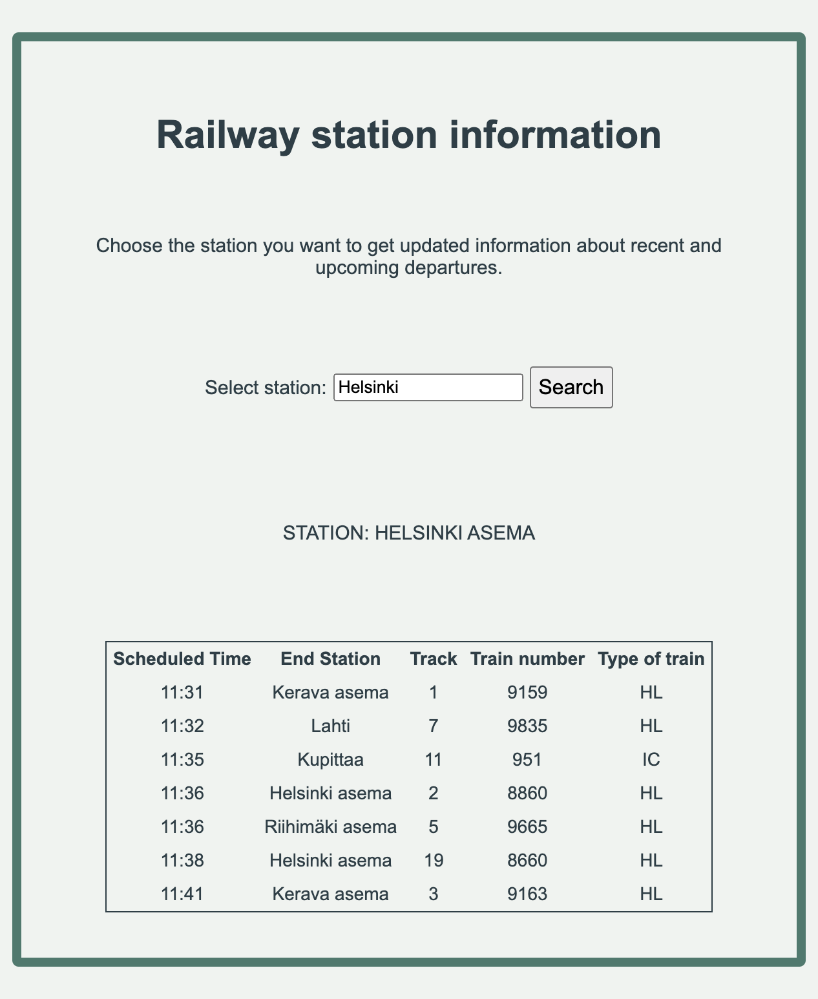

# On the track - Railway station information

This is an app where you can search for a railway station in Finland and get updated information about recent and upcoming departures.

## Quick start
Open index.html in your web browser.

## Features
* Search for stations using free text
* Retrieves information using Digitraffic API

## Development guide
Modify HTML in index.html file. 
When you need interaction, add it to main.js. 
Styling should be maintained in style.css.
